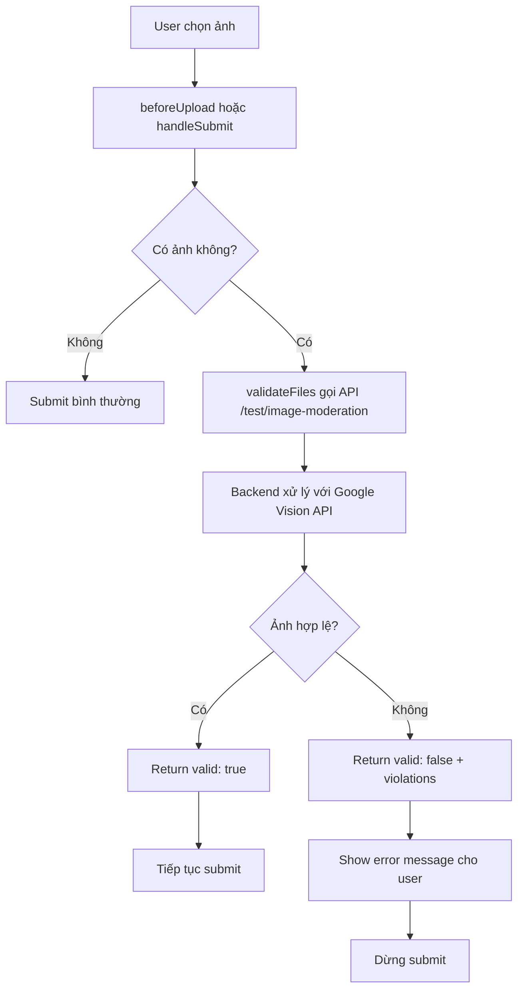
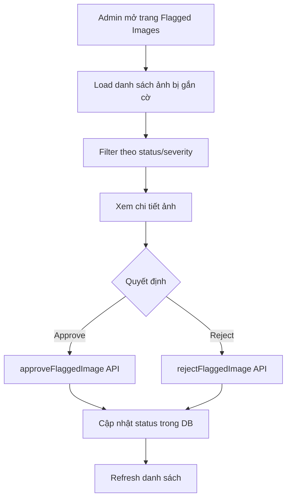

# 🎯 Frontend Integration - AI Image Moderation System

## Tổng quan

Hệ thống kiểm duyệt ảnh tự động sử dụng AI (Google Vision API) đã được tích hợp vào Frontend để ngăn chặn ảnh không hợp lệ, trùng lặp, hoặc chứa nội dung nhạy cảm khi người dùng upload ảnh.

## ✅ Các file đã tạo

### 1. **Services Layer**
- **File**: `TroNhanh_FE/src/services/imageModerationService.js`
- **Chức năng**: 
  - `validateImages(files)` - Gửi ảnh đến backend để kiểm tra
  - `getFlaggedImages(filters)` - Admin lấy danh sách ảnh bị gắn cờ
  - `approveFlaggedImage(id, note)` - Admin duyệt ảnh
  - `rejectFlaggedImage(id, note)` - Admin từ chối ảnh
  - Batch operations cho admin

### 2. **React Hooks**
- **File**: `TroNhanh_FE/src/hooks/useImageValidation.js`
- **Hooks cung cấp**:
  - `useImageValidation()` - Hook chính cho validation
    - `validateFiles(fileList, options)` - Validate danh sách file
    - `isValidating` - Trạng thái đang validate
    - `validationError` - Lỗi validation nếu có
  - `useUploadValidation(options)` - Hook cho Ant Design Upload component
    - `beforeUpload` - Function để dùng với Upload component

### 3. **Admin Page**
- **File**: `TroNhanh_FE/src/pages/AdminPage/FlaggedImages/index.jsx`
- **Chức năng**:
  - Xem danh sách ảnh bị gắn cờ
  - Filter theo trạng thái và mức độ nghiêm trọng
  - Review và duyệt/từ chối từng ảnh
  - Batch approve/reject nhiều ảnh cùng lúc
  - Xem thống kê

### 4. **Integration vào Accommodation**
- **File**: `TroNhanh_FE/src/pages/OwnerPage/Accommodation/accommodation.jsx` (đã sửa đổi)
- **Thay đổi**:
  - Import và sử dụng `useImageValidation` hook
  - Validate ảnh trước khi submit trong:
    - `handleAddFormSubmit` - Khi tạo nhà trọ mới
    - `handleUpdateFormSubmit` - Khi cập nhật nhà trọ
    - `handleManageRoomsSubmit` - Khi thêm/cập nhật phòng

---

## 🔧 Cách sử dụng

### **Option 1: Validation khi submit form (Recommended)**

```jsx
import { useImageValidation } from '../../../hooks/useImageValidation';

function MyComponent() {
    const { validateFiles, isValidating } = useImageValidation();
    
    const handleSubmit = async (values) => {
        // Collect all images
        const images = values.upload || [];
        
        // Validate before sending to backend
        const isValid = await validateFiles(images);
        
        if (!isValid) {
            return; // Stop if validation fails
        }
        
        // Proceed with form submission
        await createBoardingHouse(formData);
    };
    
    return (
        <Form onFinish={handleSubmit}>
            <Form.Item name="upload">
                <Upload>Upload Files</Upload>
            </Form.Item>
            <Button type="primary" htmlType="submit" loading={isValidating}>
                Submit
            </Button>
        </Form>
    );
}
```

### **Option 2: Real-time validation với Upload component**

```jsx
import { useUploadValidation } from '../../../hooks/useImageValidation';

function MyComponent() {
    const { beforeUpload, isValidating } = useUploadValidation({
        onValidationSuccess: (file, result) => {
            console.log('File valid:', file.name);
        },
        onValidationError: (file, result) => {
            console.error('File invalid:', result.message);
        }
    });
    
    return (
        <Upload
            beforeUpload={beforeUpload}
            multiple
        >
            <Button loading={isValidating}>
                Select Files
            </Button>
        </Upload>
    );
}
```

### **Option 3: Validation với custom callback**

```jsx
const { validateFilesWithCallback } = useImageValidation();

await validateFilesWithCallback(
    fileList,
    (result) => {
        // Success callback
        message.success('Tất cả ảnh hợp lệ!');
    },
    (result) => {
        // Error callback
        Modal.error({
            title: 'Ảnh không hợp lệ',
            content: result.message
        });
    }
);
```

---

## 📊 Flow hoạt động

### **User Upload Flow**



### **Admin Review Flow**



---

## 🚨 Xử lý lỗi

### **User-friendly Messages**

Hệ thống tự động hiển thị thông báo lỗi bằng tiếng Việt:

```
❌ Ảnh 1: Phát hiện nội dung không phù hợp (nội dung nhạy cảm)
❌ Ảnh 2: Nội dung không liên quan đến nhà trọ/phòng (bra, bikini, person)
```

### **Validation Rules**

Ảnh sẽ bị từ chối nếu:
1. **Racy content >= LIKELY** (nội dung nhạy cảm)
2. **Adult content >= UNLIKELY** (nội dung người lớn)
3. **Violent content >= UNLIKELY** (bạo lực)
4. **Forbidden labels detected** (nhãn cấm: người, quần áo, đồ lót, bikini, v.v.)

Ảnh sẽ được chấp nhận nếu:
- Chứa nhãn cho phép: room, bed, furniture, building, house, apartment, v.v.
- Không vi phạm các ngưỡng an toàn
- Không chứa nhãn cấm

---

## 🎨 Admin UI Features

### **Statistics Dashboard**
- Tổng số ảnh bị gắn cờ
- Số ảnh chờ duyệt (pending)
- Số ảnh đã duyệt (approved)
- Số ảnh từ chối (rejected)

### **Table Features**
- ✅ Row selection cho batch operations
- 🔍 Preview ảnh inline
- 🎯 Filter theo status và severity
- 📄 Pagination
- 🔄 Refresh button

### **Batch Operations**
- Approve nhiều ảnh cùng lúc
- Reject nhiều ảnh cùng lúc
- Chỉ áp dụng cho ảnh có status "pending"

---

## 🔗 API Endpoints sử dụng

### **Test/Validation**
```
POST /api/test/image-moderation
Content-Type: multipart/form-data
Body: { images: File[] }

Response: {
  success: true,
  results: [
    {
      filename: "test.jpg",
      safe: false,
      violations: [
        {
          category: "racy_content",
          confidence: "VERY_LIKELY",
          details: { forbiddenLabels: ["bikini", "bra"] }
        }
      ]
    }
  ]
}
```

### **Admin - Get Flagged Images**
```
GET /api/admin/flagged-images
Query params: { reviewStatus, severity, page, limit }
```

### **Admin - Approve/Reject**
```
PUT /api/admin/flagged-images/:id/approve
PUT /api/admin/flagged-images/:id/reject
Body: { note: string }
```

### **Admin - Batch Operations**
```
POST /api/admin/flagged-images/batch-approve
POST /api/admin/flagged-images/batch-reject
Body: { flaggedImageIds: string[], note: string }
```

---

## 📝 Checklist tích hợp vào các trang khác

Nếu bạn muốn thêm validation vào các trang upload ảnh khác:

- [ ] Import `useImageValidation` hook
- [ ] Khởi tạo hook: `const { validateFiles } = useImageValidation()`
- [ ] Collect tất cả files từ form values
- [ ] Gọi `await validateFiles(files)` trước khi submit
- [ ] Check kết quả và dừng submit nếu invalid
- [ ] Thêm loading state vào submit button

### **Example cho RoommatePost upload**

```jsx
import { useImageValidation } from '../../../hooks/useImageValidation';

function RoommatePostForm() {
    const { validateFiles, isValidating } = useImageValidation();
    
    const handleSubmit = async (values) => {
        // Validate images
        if (values.photos && values.photos.length > 0) {
            const isValid = await validateFiles(values.photos);
            if (!isValid) return;
        }
        
        // Proceed with submission
        await createRoommatePost(formData);
    };
    
    return <Form onFinish={handleSubmit}>...</Form>;
}
```

---

## 🛠️ Troubleshooting

### **Lỗi: "Lỗi khi kiểm tra ảnh"**
- **Nguyên nhân**: Backend API không khả dụng hoặc timeout
- **Giải pháp**: 
  - Kiểm tra backend đang chạy trên `http://localhost:5000`
  - Kiểm tra API keys đã cấu hình (GOOGLE_VISION_CREDENTIALS, TINIFY_API_KEY)

### **Validation luôn pass mặc dù ảnh không hợp lệ**
- **Nguyên nhân**: Backend middleware chưa được kích hoạt
- **Giải pháp**: Đảm bảo routes có middleware `validateUploadedImages`

### **Ảnh hợp lệ bị từ chối**
- **Nguyên nhân**: Ngưỡng quá nghiêm ngặt
- **Giải pháp**: Điều chỉnh `SAFETY_THRESHOLDS` trong `imageModerationService.js` (BE)

---

## 🎓 Best Practices

1. **Luôn validate ở frontend trước khi gửi đến backend**
   - Giảm tải cho server
   - Trải nghiệm người dùng tốt hơn (phản hồi nhanh)

2. **Sử dụng silent validation cho auto-upload**
   ```jsx
   validateFiles(files, { silentValidation: true })
   ```

3. **Show loading state khi đang validate**
   ```jsx
   <Button loading={isValidating}>Submit</Button>
   ```

4. **Batch validate để tối ưu**
   - Gộp tất cả ảnh (nhà trọ + phòng) vào 1 request

5. **Handle edge cases**
   - Empty upload (không có ảnh)
   - API timeout
   - Network errors

---

## 📞 Support

Nếu cần hỗ trợ:
1. Xem logs trong Console (F12)
2. Kiểm tra Network tab để xem API response
3. Xem file `TROUBLESHOOTING.md` trong Backend

---

## 🔄 Next Steps

1. ✅ Tích hợp validation vào RoommatePost upload
2. ✅ Thêm progress indicator cho multi-file validation
3. ✅ Add admin route vào routing system
4. ✅ Test với nhiều loại ảnh khác nhau
5. ✅ Deploy lên production với real API keys

---

**Last Updated**: November 18, 2025
**Version**: 1.0.0
